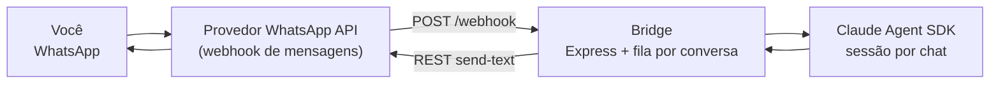

# WhatsApp → Claude Agent bridge


Esqueleto de referência pra **comandar um agente Claude pelo WhatsApp**: mensagem chega no seu número, vira sessão de um agente (Claude Agent SDK), e a resposta volta pelo WhatsApp — com allowlist, deduplicação e uma fila por conversa.

> Contexto: eu opero uma empresa por mensagem. Relatórios, tarefas, consultas a sistemas — tudo passa por agentes acessíveis no WhatsApp. Este repo é a versão mínima e aberta desse padrão: um bridge seguro entre um provedor de WhatsApp API e o Claude Agent SDK.

## Arquitetura



- **Uma fila por conversa**: mensagens do mesmo chat processam em ordem; chats diferentes, em paralelo.
- **Sessão por chat**: o agente mantém contexto entre mensagens da mesma conversa.
- **Allowlist**: só números autorizados falam com o agente. Todo o resto é ignorado (nem resposta de erro).
- **Dedupe**: webhooks reentregam; o bridge ignora `messageId` repetido.

## Rodando

```bash
cp .env.example .env   # preencha com suas credenciais
npm install
npm run dev            # sobe em :3000
```

Em desenvolvimento, exponha o webhook com um túnel (ex.: `cloudflared tunnel --url http://localhost:3000`) e cadastre a URL no seu provedor de WhatsApp.

## Variáveis de ambiente

| Var | O quê |
|---|---|
| `ANTHROPIC_API_KEY` | chave da API da Anthropic |
| `WPP_API_BASE` | base REST do seu provedor (instância/token na URL ou header, conforme provedor) |
| `WPP_CLIENT_TOKEN` | token extra do provedor, se houver |
| `WEBHOOK_SECRET` | segredo esperado no webhook (rejeita chamada sem ele) |
| `ALLOWED_NUMBERS` | E.164 separados por vírgula: `5531999999999,5531888888888` |

**Nenhum segredo vive no código.** O `.env` está no `.gitignore`.

## Segurança — leia antes de plugar na sua conta

1. **Allowlist primeiro.** Sem ela, qualquer pessoa que descobrir seu número comanda seu agente.
2. **Valide o webhook** (`WEBHOOK_SECRET`): endpoint público sem segredo é convite.
3. **Permissões do agente**: o agente só deve acessar o que aquele canal pode ver. Ferramentas perigosas, nem registradas.
4. Trate o WhatsApp como **canal não confiável**: logue tudo, e nunca ecoe segredos em resposta.

## Estrutura

```
src/
  server.ts    # webhook, allowlist, dedupe, fila por conversa
  agent.ts     # sessão do Claude Agent SDK por chat
  whatsapp.ts  # envio de resposta (interface de provedor)
```

## Licença

MIT.

## Rodando com Docker

```bash
docker build -t whatsapp-agent-bridge .
docker run --env-file .env -p 3000:3000 whatsapp-agent-bridge
```
